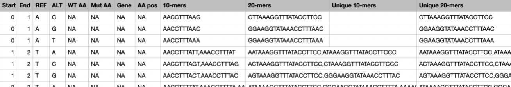

# COVID-19 k-mer Index

## What is this?

COVID-19 k-mer Index is a Python script that generates a comprehensive mutation table of the SARS-CoV-2 (COVID-19 virus) genome that uses k-mers (nucleotide substring of length k), more specifically 20-mers, to identify all possible substituion mutation from virus genome. For each position in virus's reference genome, we applied all possible substitions to generate an altered genomic sequence, which was used to determine mutant amino acids and 20-mers unique to each possible mutation.

20-mers were used because the length (20 nucleotides) makes it long enough for each possible mutation to have a unique 20-mer, similar to a unique ID. The uniqueness allows for if a certain 20-mer is identified in a mutant genome, matching it to the table will tell us exactly which position in the genome was mutated and the nucleotide to which it mutated.

We made sure to account for the ORF7a/ORF7b overlap, as well as the ribosomal frameshift at C13468 in the SARS-CoV-2 genome. Our k-mer index allows for easy and efficient lookup of all possible SARS-CoV-2 mutations, as well as identification of mutations in mutated genomes through detection of the unique 20-mer in mutant genomes, as every possible mutation has a unique 20-mer associated with it.

## Mutation Table Details

Running the file `SARS-CoV-2_k-mer_index.py` would generate a CSV file titled `output.csv` that contains the mutation table with the following columns:

|Column Name | Description|
|------------|-----------
|Start       | Start position of chromosome (the table uses a 0-based coordinate system, which counts between nucleotides)|
|End         | End position of chromosome|
|REF         | Original reference nucleotide at that position|
|ALT         | Altered nucleotide (For each reference nucleotide, there are 3 altered nucleotides (3 rows per reference nucleotide) to cover every possible nucleotide substitution.)|
|WT AA (wildtype animo acid) | Amino acid that results from the nucleotides of the reference genome|
|Mut AA (mutant animo acid) | Amino acid that results from nucleotide substitition described in ALT column |
|Gene|Gene corresponding to chromosome position|
|AA pos (amino acid position)|Position number of animo acid|
|10-mers|List of all possible 10-mers containing mutation|
|20-mers|List of all possible 20-mers containing mutation|
|Unique 10-mers|List of unique 10-mers containing mutation (10-mers that don't appear in any other mutation)|
|Unique 20-mers|List of unique 20-mers containing mutation (20-mers that don't appear in any other mutation)|

## Credits
This was created by Jenny Lam, Riley Kong, and Andrew Hong, with guidance from HoJoon Lee.
